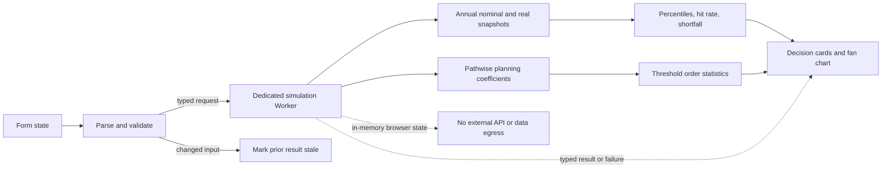

# Northstar — goal-resilience planning lab

> A local-first financial planning application that turns a reproducible Monte Carlo path set into explicit contribution, goal, and downside trade-offs.


[](https://github.com/Da0t/northstar/actions/workflows/ci.yml)


Northstar is a focused engineering case study, not a production financial-planning product. The repository makes the model, numerical boundaries, privacy scope, verification evidence, and missing production work inspectable.

## What decision does it support?

Most savings calculators answer “what happens at the average return?” Northstar asks a more useful set of conditional questions:

- What share of these modeled paths reaches my purchasing-power goal?
- What constant nominal monthly contribution reaches the goal on at least my selected share of paths?
- If I hold my contribution fixed, what real-dollar goal does that same share of paths support?
- When the goal is missed, how large is the average shortfall and what does the lower tail look like?
- How severe is the modeled drawdown of the net nominal return index?

The application runs 5,000 monthly paths locally, reports nominal and today's-dollar distributions, and presents those counterfactuals without calling them predictions or recommendations.

## Engineering evidence

| Concern | Evidence in this repository |
| --- | --- |
| Financial correctness | A pure, typed engine; deterministic closed-form fixtures; fee and inflation tests; order-statistic solver proofs; conservative cent rounding. |
| Reproducibility | A strict 32-bit seed, pinned PRNG vectors, recorded model version/scenario count, and a fixed path set for comparable reruns. |
| Defensive computation | Input/workload ceilings, finite-value checks, a cent-precision balance boundary, and typed failures instead of overflow saturation. |
| Responsive execution | A dedicated worker per run, request-ID isolation, hard cancellation by termination, and preservation of the last completed result. |
| Model governance | Explicit units, conditional-interval language, drawdown definition, intended-use limits, and a versioned model identifier. |
| User trust | Inline validation, stale-result state, preserved last valid output after failure, and visible educational disclaimers. |
| Privacy | No external API or data-egress request, account, backend, persistence, secret, or financial-data upload. Runtime fetches are limited to same-origin static assets, including the Worker chunk. |
| Reviewability | Small dependency surface, custom semantic SVG, package-level gates, CI, and an architecture decision record. |

## Product scope

Northstar currently includes:

- Nine validated assumptions: balance, contribution, horizon, real-dollar goal, planning threshold, return, volatility, inflation, and annual fee.
- Three clearly illustrative return/volatility pairs.
- Annual nominal and real P10/P25/P50/P75/P90 distributions.
- A 95% Wilson interval for finite-path Monte Carlo sampling error, explicitly conditional on the entered model assumptions.
- Fixed-path contribution and supported-goal solvers with directionally safe cent rounding.
- Average shortfall on misses, worst-decile mean, and net nominal return-index drawdown.
- A cancellable background Worker, visible seed/model/run metadata, explicit next-sample control, result freshness state, and in-memory-only execution.

The application does not choose assumptions, recommend an allocation, or replace regulated financial advice.

## Quick start

Requirements: Node.js `>=24.13.0` and pnpm `10.29.2`.

```bash
pnpm install --frozen-lockfile
pnpm dev
```

Vite prints the local URL. No backend or environment file is required.

Run all repository gates with:

```bash
pnpm lint
pnpm test
pnpm typecheck
pnpm build
```

## Architecture



[`App.tsx`](src/App.tsx) owns form parsing, execution state, cancellation, and freshness. [`simulationWorkerClient.ts`](src/simulationWorkerClient.ts) owns one Worker per run and rejects stale or malformed responses. [`simulation.ts`](src/simulation.ts) owns the model and its safety contract. [`planningMetrics.ts`](src/planningMetrics.ts) contains independent order-statistic, interval, tail, and cent-rounding functions. [`FanChart.tsx`](src/components/FanChart.tsx) renders derived output without a charting dependency.

The local-first boundary and revisit criteria are recorded in [ADR 0001](docs/adr/0001-local-first-simulation.md).

## Model

For month \(m\), Northstar draws \(z_m \sim \mathcal{N}(0,1)\). With expected annual simple return \(r\), annual volatility \(\sigma\), annual fee \(a\), and constant end-of-month contribution \(c\):

$$
f_m = \exp\left(\frac{\ln(1+r)-\tfrac{1}{2}\sigma^2}{12} + \frac{\sigma}{\sqrt{12}}z_m\right)(1-a)^{1/12}
$$

$$
B_m = B_{m-1}f_m + c
$$

The fee factor is applied proportionally each month. Return is entered gross of that fee. With annual inflation \(i\), the purchasing-power conversion at year \(t\) is:

$$
I_t=(1+i)^t, \qquad B_t^{real}=\frac{B_t}{I_t}, \qquad G_T^{nominal}=G^{today}I_T
$$

Success uses the equivalent nominal comparison \(B_T \geq G_T^{nominal}\), avoiding a second floating-point comparison path. Percentiles use linear interpolation at position \((n-1)q\).

### Fixed-path planning solver

For path \(j\), the ending balance is affine in the constant monthly contribution:

$$
B_{T,j}(c)=S_j+cK_j
$$

Northstar records the ending starting-balance component \(S_j\) and one-dollar contribution coefficient \(K_j\) while executing the path. Its pathwise contribution requirement is:

$$
c_j=\max\left(0,\frac{G_T^{nominal}-S_j}{K_j}\right)
$$

For a threshold of \(p\) over \(n\) paths, the solver selects the \(\lceil pn\rceil\)-th smallest requirement. The displayed contribution rounds upward to cents. A matching order statistic over final real balances produces the largest supported real-dollar goal, rounded downward to cents. Tests prove that each displayed boundary succeeds and that one cent beyond it does not on the same seed.

A contribution is withheld when its rounded value would exceed either the monthly input ceiling or the balance boundary on any executed path. This prevents the UI from recommending a value the same model cannot rerun.

### Sampling interval and drawdown

The goal-hit count includes a 95% Wilson interval. It estimates finite-sample Monte Carlo noise only, conditional on this model and its entered assumptions. It is not a confidence interval for real investment success and does not measure model risk.

Drawdown is the maximum peak-to-trough decline of each path's **nominal growth index after fees**. Contributions and inflation are excluded so cash flows do not masquerade as investment performance. The UI reports its median and 90th percentile across paths.

## Reproducibility and numerical contract

- The model identifier is versioned in source and included in every result.
- Mulberry32 provides a deterministic 32-bit random stream; Box–Muller converts it to standard-normal shocks.
- Normal UI reruns reuse the visible seed so an assumption change is not confounded with sampling jitter. “Use next seed” changes the sample explicitly and never runs silently.
- Scenario count is capped at 10,000, monthly work at 6,000,000 updates, and stored annual snapshots at 510,000 cells.
- Financial inputs have explicit ceilings; years are limited to 1–50.
- Modeled balances must remain finite, nonnegative, and below `Number.MAX_SAFE_INTEGER / 100`, preserving safe cent-scale integers.
- Numerical violations cross the Worker boundary as clone-safe typed failures and preserve the previous valid UI result. They never become apparent wealth through silent saturation.

Continuous balances intentionally use JavaScript numbers because this is a stochastic planning model, not a ledger. Actionable cent outputs receive conservative directional rounding and have dedicated binary-edge fixtures.

## Correctness and verification

The test suite covers:

- same-seed determinism, different-seed divergence, and pinned PRNG vectors;
- Box–Muller edge handling and invalid random sources;
- closed-form zero-volatility growth and exact contribution timing;
- fees, inflation, real-dollar conversion, and exact goal boundaries;
- ordered finite distributions and annual snapshot invariants;
- exact path-count thresholds, contribution/goal boundary proofs, tail metrics, and Wilson fixtures;
- safe-cent rounding at binary floating-point edges and the maximum supported boundary;
- workload, seed, financial-input, overflow, and combined goal/inflation limits.
- worker request round trips, clone-safe error serialization, stale-response isolation, explicit cancellation, and worker failure cleanup.

The [CI workflow](.github/workflows/ci.yml) runs lint, tests, type checking, and a production build on pushes and pull requests. There is not yet a coverage threshold or browser end-to-end job.

## Privacy and accessibility boundary

Northstar makes no external API or data-egress request at runtime. It loads same-origin static application assets, including a separate Worker chunk. Entered assumptions and generated outcomes exist only in browser memory and disappear on reload. The browser profile, extensions, development tooling, package installation, source-control hosting, static-asset host, and host device are outside that claim; local execution is a data-flow property, not a security guarantee.

Accessibility foundations include native controls, associated labels and units, inline error descriptions, pressed/busy state, live status, visible focus, responsive layout, and an SVG title/description. The project does not claim WCAG conformance: automated accessibility testing, a screen-reader audit, a zoom/reflow record, and an exact annual data table remain open work.

## Known limitations

### Financial model

- Shocks are independent and Gaussian; the model has no fat tails, serial correlation, regime changes, or empirical calibration.
- There is one aggregate return process, not an asset allocation with correlation, rebalancing, or glide paths.
- Taxes, withdrawals, contribution growth, and irregular cash flows are excluded.
- Constant return, volatility, inflation, and fee assumptions are intentionally simplified.
- Annual bands are cross-sectional percentiles, not one realizable path corridor.
- The finite-path interval addresses sampling noise, not assumption error or real-world uncertainty.

### System and product

- Each run uses one dedicated Worker and hard cancellation terminates it; there is not yet progress reporting, a worker pool, or measured performance budget.
- There is no persistence, account, backend, export, collaboration, or durable audit history.
- There are no automated end-to-end, accessibility, visual-regression, compatibility, or performance-budget checks yet.
- The prototype is not calibrated or validated for production planning, regulated use, or a measured service-level target.

## Roadmap

1. Add an accessible annual data table, browser interaction tests, and measured performance budgets.
2. Add selectable bootstrap or fat-tailed/regime models and multi-asset correlations.
3. Add sensitivity analysis that separates assumption risk from finite-path sampling noise.
4. Define retention requirements before considering export or account-backed plans.

## Code map

| Path | Responsibility |
| --- | --- |
| [`src/App.tsx`](src/App.tsx) | Form parsing, validation presentation, worker orchestration, cancellation, failure handling, and result freshness. |
| [`src/simulation.ts`](src/simulation.ts) | Typed assumptions, validation, bounded PRNG simulation, planning coefficients, snapshots, and versioned results. |
| [`src/planningMetrics.ts`](src/planningMetrics.ts) | Order statistics, Wilson interval, tail metrics, shortfall, and directional cent rounding. |
| [`src/simulationWorkerProtocol.ts`](src/simulationWorkerProtocol.ts) | Typed clone-safe run/result/failure protocol and pure request executor. |
| [`src/simulationWorkerClient.ts`](src/simulationWorkerClient.ts) | Per-run Worker lifecycle, request IDs, cancellation, and remote error reconstruction. |
| [`src/runConfig.ts`](src/runConfig.ts) | Strict decimal uint32 seed parsing, reproducible default, and explicit wraparound advancement. |
| [`src/components/FanChart.tsx`](src/components/FanChart.tsx) | Semantic SVG percentile bands, reference lines, labels, title, and description. |
| [`src/format.ts`](src/format.ts) | Whole, compact, and exact-cent financial presentation. |
| [`src/*.test.ts`](src) | Deterministic finance, safety, solver, and formatting verification. |
| [`docs/adr/0001-local-first-simulation.md`](docs/adr/0001-local-first-simulation.md) | Local execution decision and revisit criteria. |
| [`.github/workflows/ci.yml`](.github/workflows/ci.yml) | Frozen-install quality gates on pushes and pull requests. |

## Disclaimer

Northstar is educational software, not investment advice, a recommendation, or a prediction. Hypothetical results are not guarantees. Consult a qualified professional for decisions requiring financial, tax, legal, or investment advice.
