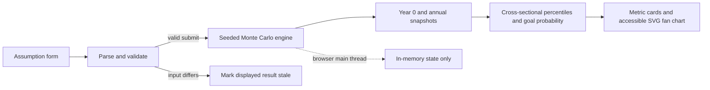

# Northstar — inspectable Monte Carlo portfolio planning

> A local-first React application for testing whether a long-term savings plan remains robust across variable market outcomes—not merely whether it works at one average return.


[](https://github.com/Da0t/northstar/actions/workflows/ci.yml)


Northstar is intentionally a focused engineering case study, not a production financial-planning product. It makes the model, tradeoffs, correctness evidence, privacy boundary, and missing production work explicit.

## The 30-second product explanation

The user decision is: **“Is my long-term savings plan robust enough when markets vary?”**

Enter a starting balance, monthly contribution, time horizon, expected annual return, annual volatility, and target. Northstar runs 5,000 possible monthly market paths, then presents the chance of meeting the target alongside downside, median, and upside outcomes. The fan chart emphasizes uncertainty instead of presenting a single forecast as fact.

## Engineering evidence

| Concern | Concrete evidence in this repository |
| --- | --- |
| Financial and data correctness | The simulation equation is isolated in [`simulation.ts`](src/simulation.ts); deterministic edge cases, threshold behavior, ordered percentiles, and validation have executable tests. |
| Determinism and auditability | A supplied 32-bit seed reproduces a run; the result records its normalized seed and scenario count. Mulberry32 and Box–Muller are implemented directly and tested through repeatability. |
| User trust | Results are marked stale as soon as assumptions diverge from the last run, invalid inputs cannot run, and limitations appear in both the interface and this document. |
| Privacy boundary | Application runtime is in-browser and in-memory, with no app network request, account, backend, persistence, secret, or financial-data upload. |
| Accessibility foundations | Native controls, labels, error associations, live status, pressed/busy state, visible focus, and an SVG title/description are implemented; audit gaps are disclosed below. |
| Reviewability and ownership | The app has a small package boundary, typed model, dependency-light chart, package-level gates, repository CI coverage, an ADR, and an explicit roadmap. |

## Product scope

Northstar currently provides:

- Six editable assumptions with inline validation and three return/volatility shortcuts.
- 5,000 fresh Monte Carlo scenarios per explicit run.
- Goal probability, P10/P50/P90 ending values, and contributed-capital context.
- Annual P10–P90 and P25–P75 bands in a responsive, custom SVG fan chart.
- Deterministic engine runs for tests and a new incremented seed for each UI rerun.
- Stale-result protection when an input changes before or during a scheduled run.
- A fully local runtime with no required account, API, environment variable, or data store.

The intended scope is a transparent educational prototype for exploring assumptions. It does not recommend an allocation, select realistic assumptions for the user, or replace regulated financial advice.

## Quick start

Run these commands from the repository root.

**Requirements:** Node.js `>=24.13.0` and pnpm `10.29.2`.

```bash
pnpm install --frozen-lockfile
pnpm dev
```

Vite prints the local URL. No backend service or environment file is required. To inspect a production build locally:

```bash
pnpm build
pnpm preview
```

## Architecture and data flow



The UI, model, and presentation are separated without creating service boundaries the prototype does not need. [`App.tsx`](src/App.tsx) owns form and result freshness state; [`simulation.ts`](src/simulation.ts) is a framework-independent calculation module; [`FanChart.tsx`](src/components/FanChart.tsx) renders derived values without a charting dependency. The local-first choice is recorded in [ADR 0001](docs/adr/0001-local-first-simulation.md).

## Simulation model

For month \(m\), Northstar draws \(z_m \sim \mathcal{N}(0,1)\), computes a gross growth factor \(g_m\), grows the existing balance, and then adds the contribution:

$$
g_m = \exp\left(\frac{\ln(1+r)-\tfrac{1}{2}\sigma^2}{12} + \frac{\sigma}{\sqrt{12}}z_m\right)
$$

$$
B_m = \operatorname{cap}\left(B_{m-1}g_m + c\right)
$$

Where:

- \(B_m\) is the balance after month \(m\).
- \(c\) is the constant contribution, added **at the end of each month** after market growth.
- \(r\) is the configured expected annual simple return. Under this lognormal construction, a one-year position without cash flows has expected gross growth of \(1+r\).
- \(\sigma\) is the annualized volatility parameter applied to independent Gaussian log-return shocks.
- \(z_m\) is generated by Box–Muller from a seeded, 32-bit Mulberry32 pseudo-random stream. This generator is reproducible, not cryptographically secure.

Each UI run uses exactly **5,000 scenarios**. The engine records year zero and then one snapshot after every 12 monthly updates. At each year, it sorts balances across all scenarios and computes P10, P25, P50, P75, and P90 with linear interpolation at position \((n-1)q\). These are cross-sectional annual percentiles; a boundary is not one scenario’s continuous path through time.

Success means the final balance is **greater than or equal to** the target. Probability is `successful scenarios / scenario count`.

### Validation and numerical guardrails

The UI requires finite, nonnegative balances, contribution, and target; a whole-number horizon from 1–50 years; expected annual return from -20% to 30%; and annual volatility from 0% to 100%. The reusable engine is slightly broader: return must be greater than -100%, volatility remains 0%–100%, scenario count must be a positive whole number, and the seed must be finite.

`capBalance` maps a non-finite intermediate or a value above `Number.MAX_VALUE / 4` to that cap, and floors other negative values at zero. This contains floating-point overflow; it is not a financially meaningful ceiling, and extreme inputs can saturate the forecast. A finite target above the cap is valid but cannot be reached by a capped path.

### Work performed per run

The default plan performs `5,000 × 20 × 12 = 1,200,000` monthly balance updates. The maximum UI horizon performs `5,000 × 50 × 12 = 3,000,000` updates, plus annual sorting and aggregation. This work remains synchronous on the browser UI thread; these counts describe workload, not production scale or measured performance.

## Engineering decisions and tradeoffs

| Decision | Benefit | Cost / boundary |
| --- | --- | --- |
| Local-only execution | Financial inputs stay in browser memory; execution needs no backend application infrastructure. | No sharing, sync, recovery, server-side policy, or durable audit history. Browser/device limits are the compute boundary. |
| Seeded simulation | Identical inputs, scenario count, and seed are reproducible for tests and debugging. | Mulberry32 is non-cryptographic; UI reruns intentionally advance the seed, so two button clicks need not match. |
| Custom semantic SVG | Precise fan-chart semantics and styling with no chart-library dependency surface. | Chart behavior, labeling, and accessibility remain this project’s responsibility. |
| Explicit freshness state | Edited assumptions cannot silently masquerade as the assumptions behind visible results. | The UI retains and visually dims the previous result until the user reruns it. |
| Fixed 5,000-scenario UI | A simple, predictable compromise between sampling precision and interaction cost. | No confidence interval, convergence control, progressive result, cancellation, or user-selected precision. |

## Correctness and verification

The suite currently contains **37 Vitest cases**: 33 simulation/validation cases and four formatting cases.

| Test area | Evidence |
| --- | --- |
| Reproducibility | Same seed and inputs yield equal results; a different seed changes the median. |
| Deterministic finance cases | Zero volatility matches a closed-form future value; zero return/volatility accumulates end-of-month contributions exactly. |
| Boundaries | Zero balances, zero target, and final value exactly equal to the target are covered. |
| Distribution invariants | Annual points include year zero; percentile values are finite, nonnegative, and ordered. |
| Input defense | Non-finite values, invalid ranges, fractional/out-of-range horizons, bad scenario counts, and non-finite seeds are rejected. |
| Presentation formatting | Whole and compact dollars, bounded probabilities, and percentage input conversion are covered. |

Run every local quality gate:

```bash
pnpm lint
pnpm test
pnpm typecheck
pnpm build
```

### Continuous integration

The repository [CI workflow](.github/workflows/ci.yml) runs on every push and pull request. It installs the frozen lockfile with pnpm 10 on Node 24, then executes the same standalone `lint`, `test`, `typecheck`, and `build` commands shown above. There is currently no coverage threshold or end-to-end browser job.

## Trust and privacy boundary

Northstar application code makes **no network request at runtime**. It has no account, backend, persistence, secret, or upload step; entered financial data and generated outcomes exist only in in-memory browser state and disappear on reload.

That statement is scoped to Northstar’s application runtime. The browser and its extensions/dev tooling, the local Vite server, dependency installation, source-control hosting, and any surrounding infrastructure are outside this claim. Local execution is a data-flow property here, not a security guarantee.

## Accessibility

Implemented foundations include associated labels and native numeric inputs; a `fieldset`/`legend` for market profiles; native buttons with `aria-pressed`; `aria-invalid` and associated inline errors; an explained disabled state; `aria-busy`; a polite live status region; visible keyboard focus; responsive layouts; and an SVG `role="img"` with generated title and description.

What is **not** established: there is no automated accessibility test, screen-reader audit, full keyboard test record, zoom/reflow audit, or documented color-contrast measurement. The SVG describes the chart at a high level but does not expose every annual point as a data table. The implemented semantics are a foundation, not a WCAG conformance claim.

## Known limitations

### Financial model

- Monthly shocks are independent and Gaussian, producing lognormal growth with constant return and volatility assumptions.
- The model has no inflation, taxes, fees, withdrawals, changing contributions, asset allocation, cross-asset correlation, rebalancing, fat tails, serial correlation, or market regimes.
- Inputs and displayed outcomes are nominal dollars; presets are illustrative shortcuts, not calibrated recommendations.
- Annual bands are independently computed cross-sectional percentiles, not a single realizable scenario corridor.
- A finite 5,000-path sample introduces sampling error, but the UI does not report confidence intervals or convergence diagnostics.
- Mulberry32 supports repeatability but is not suitable for security-sensitive randomness.

### System and product

- Simulation and annual sorting run on the main thread; the short timer lets the running state render but does not make the calculation asynchronous.
- There is no persistence, backend, account, export, collaboration, or recovery flow.
- There are no end-to-end, visual-regression, browser-compatibility, performance-budget, or automated accessibility tests.
- The prototype has not been validated for production financial planning, regulatory use, cloud scale, or a measured performance target.

## Production-minded roadmap

1. **Harden model transparency:** add real-dollar results, fees and tax assumptions, versioned methodology, sensitivity analysis, and independent calculation fixtures.
2. **Protect responsiveness:** move work to a Web Worker and add cancellation, progress, scenario controls, and measured performance budgets.
3. **Broaden risk modeling:** support asset classes, correlation, allocation/rebalancing, and explicitly selectable bootstrap or fat-tailed/regime models.
4. **Raise product assurance:** add end-to-end flows, automated accessibility checks, manual screen-reader/keyboard/zoom audits, and visual regression coverage.
5. **Add persistence only with a clear need:** define retention and threat models first, then consider encrypted export or account-backed plans without weakening the local-first default.

## Code map

| Path | Responsibility |
| --- | --- |
| [`src/App.tsx`](src/App.tsx) | Form parsing, validation presentation, presets, seed progression, simulation orchestration, and result freshness. |
| [`src/simulation.ts`](src/simulation.ts) | Typed assumptions, validation, PRNG/normal generation, simulation, cap behavior, snapshots, percentiles, and success probability. |
| [`src/simulation.test.ts`](src/simulation.test.ts) | Determinism, finance edge cases, distribution invariants, and validation tests. |
| [`src/format.ts`](src/format.ts) and [`src/format.test.ts`](src/format.test.ts) | Currency/percentage presentation and its unit tests. |
| [`src/components/FanChart.tsx`](src/components/FanChart.tsx) | Responsive SVG percentile bands, reference lines, labels, title, and description. |
| [`src/styles.css`](src/styles.css) | Responsive layout, interaction states, chart styling, focus treatment, and visually hidden live text. |
| [`docs/adr/0001-local-first-simulation.md`](docs/adr/0001-local-first-simulation.md) | Local execution decision and revisit criteria. |
| [`package.json`](package.json) | Package scripts and direct dependency surface. |

## Why this project exists

Many savings calculators collapse uncertainty into one compounding curve. Northstar explores a more honest interaction: show a range, make the assumptions editable, preserve the link between inputs and results, and explain what the model cannot know. As an engineering project, it demonstrates turning a domain equation into an inspectable product with deterministic tests, explicit state transitions, a narrow privacy boundary, accessible foundations, and documented tradeoffs.

## Disclaimer

Northstar is educational software, not investment advice, a recommendation, or a prediction. Its hypothetical results are not guarantees. Consult a qualified professional for decisions that require financial, tax, legal, or investment advice.
